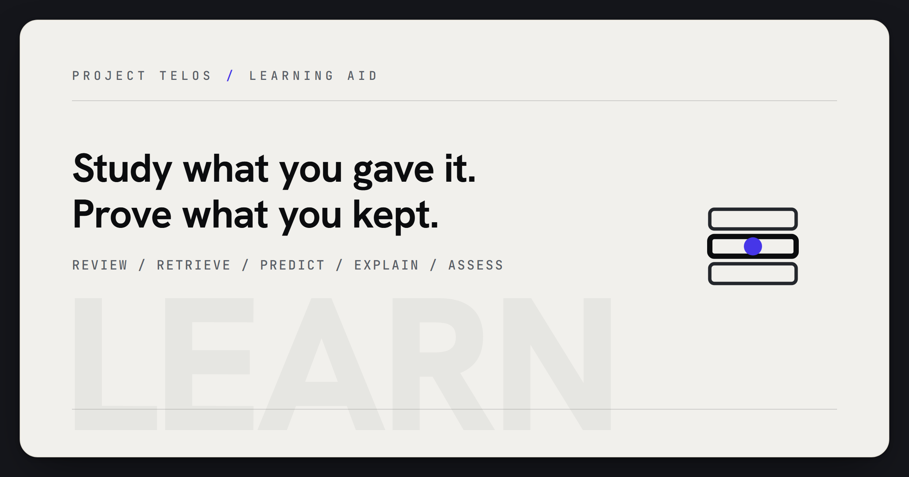

<p align="center">
  
</p>
<!-- Project mark: docs/brand/learn-mark.svg -->

# learn

> Study smarter, prove it honestly, and never let the machine take the test for you.

[Project Telos](https://harperz9.github.io) | [gather](https://github.com/HarperZ9/gather) | [crucible](https://github.com/HarperZ9/crucible) | [index](https://github.com/HarperZ9/index) | [forum](https://github.com/HarperZ9/forum) | [telos](https://github.com/HarperZ9/telos) | [learn](https://github.com/HarperZ9/learn) | [emet](https://github.com/HarperZ9/emet) | [buildlang](https://github.com/HarperZ9/buildlang)

[](https://github.com/HarperZ9/learn/actions/workflows/ci.yml)


## Try it

```bash
node --test          # 240 tests
node src/cli.mjs status
node src/cli.mjs doctor
```

```bash
node src/cli.mjs tutor plan mysession --topic "derivatives" --objectives "power-rule,chain-rule"
node src/cli.mjs tutor record mysession --objective power-rule --prompt "d/dx x^3" --answer "3x^2" --correct true
node src/cli.mjs tutor study mysession --now 2026-06-30T00:00:00Z
node src/cli.mjs tutor mastery mysession
```

`tutor study` is the one command to run first: it composes what is due, what you keep getting
wrong, a mixed practice order, and the mastery-gate verdict, all from your own recorded attempts.

## Why it matters

Course platforms automate the logistics (next module, next quiz, next certificate) but they do
not tell you whether you actually learned anything, and a generic AI tutor will happily hand you
the answer if you ask twice. `learn` refuses to be either of those. It automates the logistics of
courses and certifications, runs a real learning loop (spaced repetition, retrieval practice,
self-explanation, misconception tracking) against your own practice, and halts hard at every step
that is supposed to prove *you* know it. The receipt it produces separates what the engine did for
you from what you did yourself, so a mastery claim is never just the tool's word.

## Work with it

Bring a course, a certification, or a topic you are teaching yourself, and use whichever
capability matches where you are stuck:

- **Spaced repetition** (`schedule.mjs`): by default an SM-2-lite/Leitner scheduler over your own
  practice log; `tutor due` reports which objectives are overdue for review, most-overdue first.
- **Adaptive per-item memory model** (`fsrs.mjs` + `itemscheduler.mjs`, opt-in): an FSRS-class
  model that tracks per-item *difficulty*, *stability*, and *retrievability* and schedules the next
  review against a retention target you set (e.g. 90%). Where the Leitner ladder re-surfaces whole
  objectives on fixed intervals, this decays each item's recall probability on its own curve and
  surfaces the item you are *most likely to have forgotten* next. Enable it per session and grade
  each attempt 0-4 (fail / slip / lapse / review / easy):

  ```sh
  learn tutor plan sess --topic "SC-900" --objectives "identity,compliance" --enable-fsrs
  learn tutor record sess --objective identity --grade 3 --now 2026-06-30T00:00:00Z
  learn tutor study  sess --now 2026-07-15T00:00:00Z --use-fsrs --desired-retention 0.9
  ```

  It is a scheduling *hint*, never a verdict: `itemState` is derived and self-healing, and the
  mastery-gate keeps reading your witnessed `attempts` only, so the study schedule can never move
  the "ready" line. The flags are advisory — on a session created without `--enable-fsrs` they fall
  back to the Leitner/interleave path. Timestamps are always injected (`--now`), so schedules are
  fully deterministic and re-checkable.
- **Retrieval practice from your own material** (`retrieval.mjs`): turns claims your *own* draft
  already asserts (via `assist`) into blanked cloze prompts you answer from memory, each carrying
  its source so you can check yourself after, not before.
- **Predict-then-observe** (`predict.mjs`): record your prediction before you see a rendered aid
  or worked example, then score it against what actually happened; a pending prediction is never
  silently counted as correct.
- **Self-explanation** (`explain.mjs`): wraps your own explanation of a concept into a crucible
  thesis and buckets its claims into grounded / shaky / unverifiable, so "explain it back to me"
  gets a real check instead of a vibe.
- **Misconception targeting** (`misconception.mjs`): aggregates your own wrong attempts and your
  own feedback per objective, ranked by count, so the next study session spends time where it is
  actually needed.
- **Concept map** (`map.mjs`): normalizes objectives (plain strings or `{id, text, requires}`),
  computes a topological learning path, and gates readiness on prerequisite mastery so you are not
  told to study something whose prerequisite you have not passed yet.
- **`learn tutor study`** (`study.mjs`): the orchestrator. Composes due + misconceptions +
  interleaved order + prerequisite readiness + the mastery-gate into one plan, and a witnessed,
  hash-chained `study-receipt` you can keep.
- **Receipt re-verification** (`reverify.mjs`): `learn tutor reverify` recomputes an emitted
  receipt's own evidence instead of trusting its stored booleans. The hash chain over the
  witnessed practice entries must recompute (a break is typed `CHAIN_BROKEN` with the offending
  entry) and the stored mastery verdict must re-derive from the recorded attempts under the
  recorded policy (a divergence is typed `VERDICT_MISMATCH`). A chainless receipt is `UNVERIFIED`,
  never verified; a clean re-check exits 0 with a witnessed summary digest.
- **Proof-packet lessons** (`prooflesson.mjs`): `learn tutor prooflesson` turns a proof packet
  (a verified-claim record with sources, hashes, and a MATCH/DRIFT/UNVERIFIABLE verdict) into a
  lesson you study from: an explanation scaffold that prompts you to derive the reasoning
  yourself, retrieval questions built from the packet's own fields, and a verifier binding that
  ties the lesson to the packet's verdict and source hashes. A DRIFT or UNVERIFIABLE packet also
  yields a typed misconception record (contradicted / overclaim / missing_evidence) asking why
  the proof attempt failed. The lesson's verdict always equals the packet's verdict, and the
  emitted lesson receipt is hash-chained and covered by `tutor reverify`.

Underneath the learning loop, the original credential-logistics engine still runs workflows
(`learn run` / `learn resume`), halts at every graded `assess` step for you to complete yourself,
and emits a provenance receipt separating automated logistics from your own graded work.

## What to test first

- Run `node src/cli.mjs tutor plan` on a real topic you are studying, record a handful of honest
  practice attempts (including some wrong ones), then run `tutor study` and check whether the plan
  it hands back actually reflects where you are weak.
- Try to get any tutor command to produce, hint, or auto-fill an answer to something you would
  call a real graded assessment. If it does, that is the most useful bug report `learn` can get:
  every one of those paths has a falsifiable test, and a break there is the whole product breaking.
- Run a workflow (`learn run examples/*.json` if present, or your own `workflow.json`) against the
  `FakeDriver` and confirm it halts cleanly at `assess`, with nothing actuated past that point.

## Current status

- **Release:** `1.6.0`; command `learn`; Node >= 20; zero external dependencies (ES modules,
  `node:test`).
- **Operator surface:** `learn status`, `learn doctor`, `learn run/resume/verify/receipt`,
  `learn assist`, `learn visualize`, and `learn tutor <plan|record|mastery|receipt|reverify|
  prooflesson|due|misconceptions|retrieval|explain|predict|score|path|study|study-receipt>`. The
  zero-dep MCP server (`src/mcp.mjs`) exposes the advisory/read tools: `learn_doctor`,
  `learn_status`, `learn_verify`, `learn_receipt`, `learn_dry_run`, `learn_tutor_plan`,
  `learn_tutor_record`, `learn_tutor_mastery`, `learn_tutor_due`, `learn_tutor_studyplan`,
  `learn_tutor_misconceptions`, `learn_tutor_reverify`, `learn_tutor_prooflesson`, and
  `learn_visualize_dry_run`. Actuation (real runs) stays operator-driven on the CLI.
- **Test floor:** 240 tests across the runtime, adapters, receipt, tutor/learning-loop, and telos
  interop, including a falsifiable test per integrity invariant.
- **Housekeeping:** see [CHANGELOG.md](CHANGELOG.md) for version history.

## What it does

Two engines share one integrity floor.

The **credential engine** turns a declarative workflow into a witnessed run: navigate a course,
open a module, reach a graded step. At every `assess` step (and at consent, CAPTCHA, payment, or
account-creation steps) it halts and waits for you. Nothing graded ever auto-completes, in either
submission mode. When you resume, your attestation that you did the work yourself is recorded
into the ledger alongside everything the engine actually did.

The **tutor / learning loop** is the teach-you engine underneath it: it plans objectives, generates
practice (cloze prompts, prediction slots, self-explanation prompts), schedules review with spaced
repetition, tracks your own misconceptions, and composes all of it into a study plan. Its
`mastery()` verdict is a function of your own scored practice attempts, full stop; it never reads
a render, a visualization, or a pending prediction as if it were a graded answer.

## Architecture (all zero-dep)

- `accountability/`: `witness` (content-addressed), `ledger` (hash-chained, tamper-evident),
  `gate` (default-deny; `assess` always halts).
- `workflow/`: declarative step schema + seal.
- `runtime/`: the runner. Gate -> actuate -> witness -> verify -> ledger; halt/resume.
- `actuation/`: `FakeDriver` (offline/deterministic) and `NativeDriver` (real browser over
  native-control).
- `adapters/`: `generic` config-driven adapter + an LMS pack (Coursera, Udemy, LinkedIn Learning,
  edX, Credly, Microsoft Learn, NonprofitReady, generic self-paced). No graded logic anywhere.
- `receipt/`: dual-plus format. JSON + Markdown + HTML, separating logistics from human
  assessment and from aid visualizations.
- `assist/`: study aid. Flags claims to verify (crucible) and sources to cite (gather) in *your
  own* draft; authors nothing.
- `tutor/`: the teach-you engine. `tutor.mjs` (session, practice, mastery-gate),
  `schedule.mjs` (spaced repetition; opt-in FSRS delegation), `fsrs.mjs` (pure FSRS-class memory
  math), `itemscheduler.mjs` (per-item difficulty/stability state + retrievability ranking),
  `misconception.mjs` (aggregation), `retrieval.mjs`
  (cloze generation + interleaving), `explain.mjs` (self-explanation grading), `predict.mjs`
  (predict-then-observe), `map.mjs` (concept map + prerequisite gating), `study.mjs` (the
  orchestrator + witnessed study-receipt), `reverify.mjs` (receipt re-verification: recomputed
  chain + re-derived verdict, typed failures), `prooflesson.mjs` / `prooflessonverify.mjs`
  (proof-packet -> lesson: scaffold + retrieval questions + verifier binding, typed misconception
  records, chained lesson receipts covered by reverify), `tutorstore.mjs` (session persistence).
- `interop/telos.mjs`: the visualization bridge. `concept -> math_physics scene-spec -> witnessed
  AID render`. Delegates rendering to the telos engine over `LEARN_TELOS_CMD` (fail-closed); learn
  never imports telos internals or picks the renderer profile.
- `resume/`: ingests an earned credential into a resume/portfolio, carrying the provenance flag.
- `mcp.mjs`: zero-dep JSON-RPC/stdio MCP server exposing advisory tools. Actuation stays
  operator-driven on the CLI.
- `doctor.mjs` / `status.mjs`: the operator-spine self-check + capability envelope.

## Integrity invariants (each has a falsifiable test; `doctor` re-checks them at runtime)

1. `assess` steps never auto-complete. The engine halts for the operator, in **both** submission
   modes. Submission mode (`manual` vs `witnessed-auto`) governs only the `submit` action; it never
   touches graded work.
2. Default-deny: only known step kinds run; an undeclared step is refused, nothing actuated.
3. Every step is witnessed; the ledger is hash-chained and tamper-evident.
4. The receipt separates automated logistics from human assessment.
5. Credentials, payment, CAPTCHA, and account creation halt for the operator.
6. Aid visualizations are learning aids only. They are witnessed and hash-chained, but never
   satisfy an `assess` step or enter the graded receipt channels.
7. Every learning-loop capability (schedule, misconception, retrieval, explain, predict, map,
   study) generates practice, structures study, or checks the operator's own work, and the
   `mastery()` verdict is a function of the operator's own scored practice attempts only, never
   of a render, a visualization, or an unscored pending prediction.
8. A tutor receipt re-verifies from its own recorded evidence. `learn tutor reverify` recomputes
   the hash chain and re-derives the mastery verdict; failures are typed (`CHAIN_BROKEN`,
   `VERDICT_MISMATCH`), author-controlled booleans never gate, and a chainless receipt is
   `UNVERIFIED`, never verified.
9. A proof-packet lesson never outruns its packet. The lesson's verdict is copied from the
   packet's verdict with no override path, a forged verdict enum is rejected, the scaffold prompts
   the learner instead of dumping the packet's reasoning, and the chained lesson receipt fails
   reverify (`CHAIN_BROKEN` / `VERDICT_MISMATCH`) when tampered.

## Interop

`gather` (source receipts) and `crucible` (measured claim evaluation) power the assist pillar;
`native-control` provides real-browser actuation. See [`docs/smoke.md`](docs/smoke.md) for an
operator-run live-LMS smoke. `telos` renders concepts (math/physics/science) as witnessed learning
aids via its `math_physics` lane.

## Docs

- [docs/ARCHITECTURE.md](docs/ARCHITECTURE.md): the accountability spine (witness, ledger, gate)
  and how both engines, credential logistics and the learning loop, are built from it.
- [docs/HOW-IT-WORKS.md](docs/HOW-IT-WORKS.md): the study loop walked step by step, plan, due,
  retrieval, predict-then-observe, self-explanation, misconceptions, mastery-gate, witnessed
  receipt.
- [USAGE.md](USAGE.md): install and basic usage for both engines and the MCP surface.
- [docs/ENTERPRISE-READINESS.md](docs/ENTERPRISE-READINESS.md): the Project Telos context-envelope
  and action-receipt contract for unattended agent workflows.
- [CHANGELOG.md](CHANGELOG.md): version history.
- [AGENTS.md](AGENTS.md): scope, developer contract, and verification commands.
- [CONTRIBUTING.md](CONTRIBUTING.md): how to send a change.
- [AUTHORS.md](AUTHORS.md): authorship.
- [docs/smoke.md](docs/smoke.md): operator-run live-LMS smoke test.
- [docs/brand/README.md](docs/brand/README.md): brand asset provenance.

## License

Fair-source (see [LICENSE](LICENSE)), including a binding integrity clause: derivatives may not
remove the guarantee that graded assessments always halt for the human.

## For developers

Keep the public README, package metadata, and examples aligned with current behavior. Before
opening a PR, run the full suite.

```bash
node --test
node src/cli.mjs doctor
```
