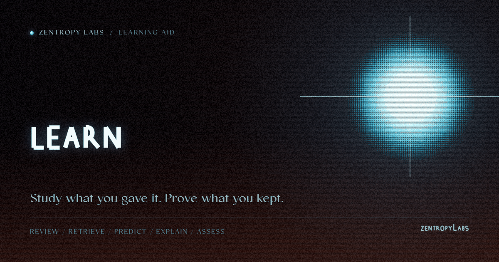

<p align="center"></p>

**Your own material, a runnable course: spaced repetition, retrieval practice, real grading, zero dependencies.**

[](https://www.npmjs.com/package/@harperz9/learn)
[](https://github.com/HarperZ9/learn/actions/workflows/ci.yml)


[Project Telos](https://harperz9.github.io) | [gather](https://github.com/HarperZ9/gather) | [crucible](https://github.com/HarperZ9/crucible) | [index](https://github.com/HarperZ9/index) | [forum](https://github.com/HarperZ9/forum) | [telos](https://github.com/HarperZ9/telos) | [learn](https://github.com/HarperZ9/learn) | [emet](https://github.com/HarperZ9/emet) | [buildlang](https://github.com/HarperZ9/buildlang)

`learn` turns whatever you are studying, a course, a certification, or your own notes, into a
runnable learning loop. Spaced repetition schedules your reviews, retrieval practice builds cloze
prompts from your own drafts, misconception tracking spends your next session where you are
actually weak, and a concept map gates readiness on prerequisites. One command, `learn tutor
study`, composes all of it into a single plan from your recorded attempts. A second engine
automates course and certification logistics while halting at every graded step so the work is
yours. Zero external dependencies, Node 20 or newer.

## Features

- **One-command study plans.** `learn tutor study` composes what is due, what you keep getting
  wrong, an interleaved practice order, prerequisite readiness, and the mastery verdict into a
  single plan from your own recorded attempts.
- **Adaptive per-item memory model** (opt-in). An FSRS-class scheduler tracks per-item difficulty,
  stability, and retrievability, decays each item's recall probability on its own curve, and
  surfaces the item you are most likely to have forgotten, against a retention target you set
  (for example 90%). Grade each attempt 0 to 4. It is a scheduling hint, never a verdict: the
  mastery gate reads only your witnessed attempts, so the schedule can never move the "ready" line.
- **Spaced repetition by default.** An SM-2-lite/Leitner scheduler over your practice log;
  `tutor due` reports which objectives are overdue, most-overdue first. Timestamps are injected
  with `--now`, so every schedule is deterministic and re-checkable.
- **Re-derivable schedule + per-learner fit.** `tutor derive-schedule` replays your witnessed
  graded log to rebuild the FSRS scheduling state from scratch, then audits it against the cached
  `itemState`: a stale or tampered cache is caught as `DRIFT` with a per-field diff, never silently
  trusted. `--optimize` fits an advisory per-learner initial-difficulty prior from your own
  accuracy; it never changes the audit verdict or the mastery gate.
- **Retrieval practice from your own material.** Claims your own draft asserts become blanked
  cloze prompts you answer from memory, each carrying its source so you check yourself after,
  not before.
- **Misconception targeting.** Your wrong attempts and your own feedback are aggregated per
  objective, ranked by count, so the next session spends time where it is actually needed.
- **Predict-then-observe.** Record a prediction before you see a rendered aid or worked example,
  then score it against what happened. A pending prediction is never silently counted correct.
- **Self-explanation with a real check.** Your explanation of a concept is bucketed into grounded,
  shaky, and unverifiable claims, so "explain it back" gets a check instead of a vibe.
- **Concept map with prerequisite gating.** Objectives (plain strings or `{id, text, requires}`)
  get a topological learning path; you are never told to study something whose prerequisite you
  have not passed.
- **Proof-packet lessons.** `tutor prooflesson` turns a verified-claim packet (sources, hashes,
  MATCH/DRIFT/UNVERIFIABLE verdict) into a lesson: a scaffold that prompts you to derive the
  reasoning yourself, retrieval questions from the packet's own fields, and a binding to the
  packet's verdict. A failed packet also yields a typed misconception record.
- **Re-verifiable receipts.** `tutor reverify` recomputes a receipt's own evidence: the hash chain
  must recompute (a break is typed `CHAIN_BROKEN`) and the mastery verdict must re-derive from
  the recorded attempts (`VERDICT_MISMATCH` otherwise). A chainless receipt is `UNVERIFIED`,
  never verified.
- **Credential-logistics engine.** `learn run` executes a declarative course workflow and halts
  at every graded `assess` step, plus consent, CAPTCHA, payment, and account creation. Nothing
  graded ever auto-completes, in either submission mode.
- **Zero-dep MCP server.** `src/mcp.mjs` exposes fourteen advisory/read tools over stdio JSON-RPC
  for agent use; actuation stays operator-driven on the CLI.

## Install

```bash
git clone https://github.com/HarperZ9/learn.git
cd learn
node --test          # 284 tests, zero dependencies, nothing to build
```

Or install the published release: `npm install -g @harperz9/learn` (the repository can run ahead
of the latest npm publish; the repo is the source of truth). Library use is available through the
package exports `@harperz9/learn`, `@harperz9/learn/doctor`, and `@harperz9/learn/status`.

## Quickstart

```bash
node src/cli.mjs tutor plan mysession --topic "derivatives" --objectives "power-rule,chain-rule"
node src/cli.mjs tutor record mysession --objective power-rule --prompt "d/dx x^3" --answer "3x^2" --correct true
node src/cli.mjs tutor study mysession --now 2026-06-30T00:00:00Z
node src/cli.mjs tutor mastery mysession
```

Expected output of `tutor study` after that one attempt:

```
tutor study mysession: 1 due, 0 misconception(s), mastery not yet
  due: chain-rule
  order: power-rule, chain-rule
  readiness: power-rule:unlocked, chain-rule:unlocked
```

`tutor study` is the one command to run first: it composes what is due, what you keep getting
wrong, a mixed practice order, and the mastery-gate verdict, all from your own recorded attempts.

For the adaptive scheduler, create the session with `--enable-fsrs`, grade attempts 0 to 4, and
ask for a retention-targeted plan:

```bash
node src/cli.mjs tutor plan sess --topic "SC-900" --objectives "identity,compliance" --enable-fsrs
node src/cli.mjs tutor record sess --objective identity --grade 3 --now 2026-06-30T00:00:00Z
node src/cli.mjs tutor study sess --now 2026-07-15T00:00:00Z --use-fsrs --desired-retention 0.9
```

The flags are advisory: on a session created without `--enable-fsrs` they fall back to the
Leitner/interleave path.

## A worked session

Record a wrong attempt with feedback, watch the plan shift, then emit and re-verify a receipt:

```bash
node src/cli.mjs tutor record mysession --objective chain-rule \
  --prompt "d/dx sin(x^2)" --answer "cos(x^2)" --correct false --feedback "forgot inner derivative"
node src/cli.mjs tutor misconceptions mysession
# tutor misconceptions mysession: 1 objective(s)
#   chain-rule (1x): forgot inner derivative

node src/cli.mjs tutor study-receipt mysession --now 2026-06-30T00:00:00Z
# tutor study-receipt mysession: verified true, mastery not yet -> tutor/mysession.study-receipt.json

node src/cli.mjs tutor reverify mysession
# tutor reverify mysession: VERIFIED (1 receipt(s))
```

The misconception now steers the next `tutor study` plan, and the receipt re-verifies from its own
recorded evidence rather than a stored boolean.

## The credential engine

The second engine turns a declarative workflow into a witnessed run: navigate a course, open a
module, reach a graded step.

```bash
node src/cli.mjs run examples/course.json --id run1
node src/cli.mjs resume run1 --attest "completed Quiz 1 myself"
node src/cli.mjs verify run1
node src/cli.mjs receipt run1
```

At every `assess` step (and at consent, CAPTCHA, payment, or account creation) it halts and waits
for you. When you resume, your attestation is recorded alongside everything the engine actually
did. Drivers: `FakeDriver` (offline, deterministic) and `NativeDriver` (real browser over
native-control). An adapter pack covers Coursera, Udemy, LinkedIn Learning, edX, Credly,
Microsoft Learn, NonprofitReady, and generic self-paced courses, with no graded logic anywhere.
See [docs/smoke.md](docs/smoke.md) for an operator-run live-LMS walkthrough.

## MCP server

```bash
node src/mcp.mjs
```

Exposes the advisory/read tools over stdio JSON-RPC: `learn_doctor`, `learn_status`,
`learn_verify`, `learn_receipt`, `learn_dry_run`, `learn_tutor_plan`, `learn_tutor_record`,
`learn_tutor_mastery`, `learn_tutor_due`, `learn_tutor_studyplan`, `learn_tutor_misconceptions`,
`learn_tutor_reverify`, `learn_tutor_prooflesson`, and `learn_visualize_dry_run`. The MCP surface
never performs a real course action or answers a graded step.

## Status

- **Release:** `1.6.0`; command `learn`; Node >= 20; zero external dependencies (ES modules,
  `node:test`).
- **CLI surface:** `learn status`, `learn doctor`, `learn run/resume/verify/receipt`,
  `learn assist`, `learn visualize`, and `learn tutor <plan|record|mastery|receipt|reverify|
  prooflesson|due|misconceptions|retrieval|explain|predict|score|path|study|study-receipt>`.
- **Tests:** 284 across the runtime, adapters, receipt, tutor/learning-loop, and telos interop,
  including a falsifiable test per integrity invariant. `learn doctor` re-checks the invariants
  at runtime and must report `MATCH` on every line.
- **History:** [CHANGELOG.md](CHANGELOG.md).

## Integrity boundary

`learn` never produces, hints, or auto-fills an answer to a graded assessment; the `mastery()`
verdict is a function of your own scored practice attempts only, never of a render, a
visualization, or a pending prediction. Every run writes a witnessed, hash-chained receipt that
separates automated logistics from your own graded work, and `tutor reverify` re-checks a receipt
from its recorded evidence. If you can get any command to cross that line, that is the most useful
bug report this tool can receive: every such path has a falsifiable test.

## Docs

- [docs/INTRODUCTION.md](docs/INTRODUCTION.md): what `learn` is, core concepts, and a
  first-ten-minutes walkthrough.
- [docs/HOW-IT-WORKS.md](docs/HOW-IT-WORKS.md): the study loop step by step: plan, due, retrieval,
  predict-then-observe, self-explanation, misconceptions, mastery-gate, witnessed receipt.
- [docs/ARCHITECTURE.md](docs/ARCHITECTURE.md): the accountability spine (witness, ledger, gate)
  and how both engines are built from it.
- [USAGE.md](USAGE.md): install and basic usage for both engines and the MCP surface.
- [docs/ENTERPRISE-READINESS.md](docs/ENTERPRISE-READINESS.md): context-envelope and
  action-receipt contract for unattended agent workflows.
- [docs/smoke.md](docs/smoke.md): operator-run live-LMS smoke test.
- [AGENTS.md](AGENTS.md): scope, developer contract, and verification commands.
- [CONTRIBUTING.md](CONTRIBUTING.md) and [AUTHORS.md](AUTHORS.md).
- [docs/brand/README.md](docs/brand/README.md): brand assets (`docs/brand/learn-hero.png`,
  `docs/brand/learn-hero.svg`, `docs/brand/learn-mark.svg`) and their provenance.

Peer tools: [gather](https://github.com/HarperZ9/gather) (source receipts) and
[crucible](https://github.com/HarperZ9/crucible) (measured claim evaluation) power the assist
pillar; [telos](https://github.com/HarperZ9/telos) renders math/physics concepts as witnessed
learning aids via its `math_physics` lane.

## License

Fair Source (see [LICENSE](LICENSE)), including a binding integrity clause: derivatives may not
remove the guarantee that graded assessments always halt for the human.

## For developers

Keep the public README, package metadata, and examples aligned with current behavior. Before
opening a PR, run the full suite.

```bash
node --test
node src/cli.mjs doctor
```

## What this believes

This tool is one lane of a family that holds a single belief steady across
every surface: knowledge open to anyone who can attain the means; acceptance
decided by external checks, never reputation; every result re-runnable;
honest nulls first-class; ownership earned by comprehension; learning woven
into the work. The full text lives in [CREDO.md](CREDO.md).
The long form of this belief: [The Unbundling](https://github.com/HarperZ9/flywheel/blob/fix/release-model-identity/docs/essays/2026-07-13-the-unbundling.md).

---

**[Zentropy Labs](https://github.com/ZentropyLabs-ai)** · order out of entropy. An independent lab building evidence-first tools that leave a re-checkable artifact behind. Built by Zain Dana Harper in Seattle. The full workbench is at [Project Telos](https://harperz9.github.io).
